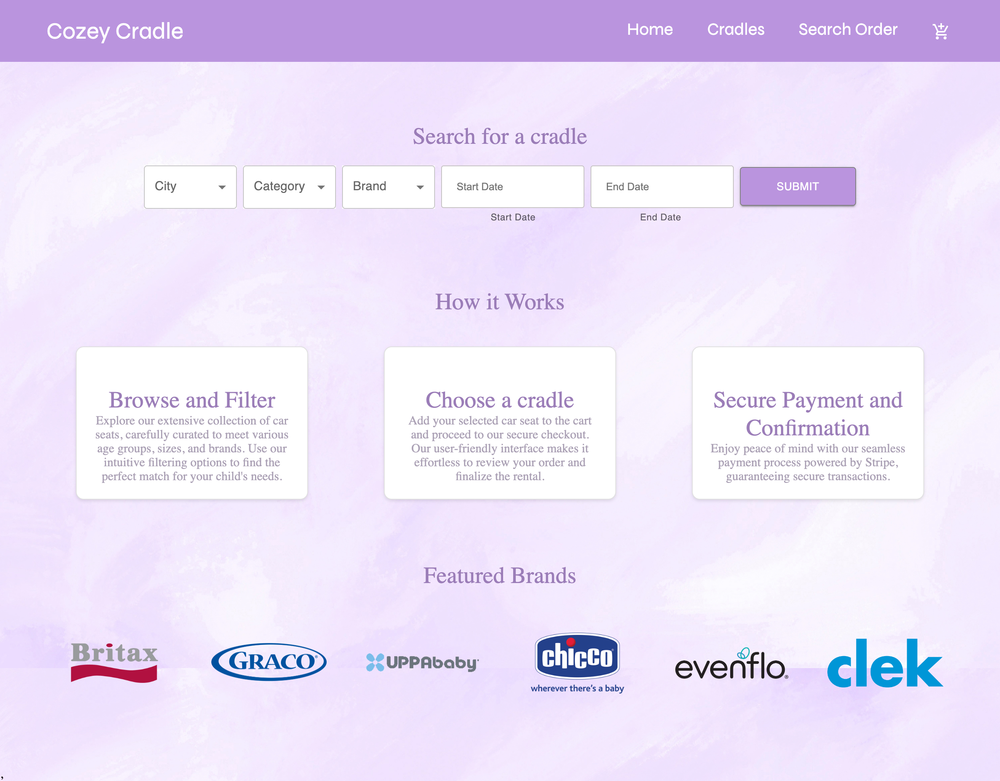
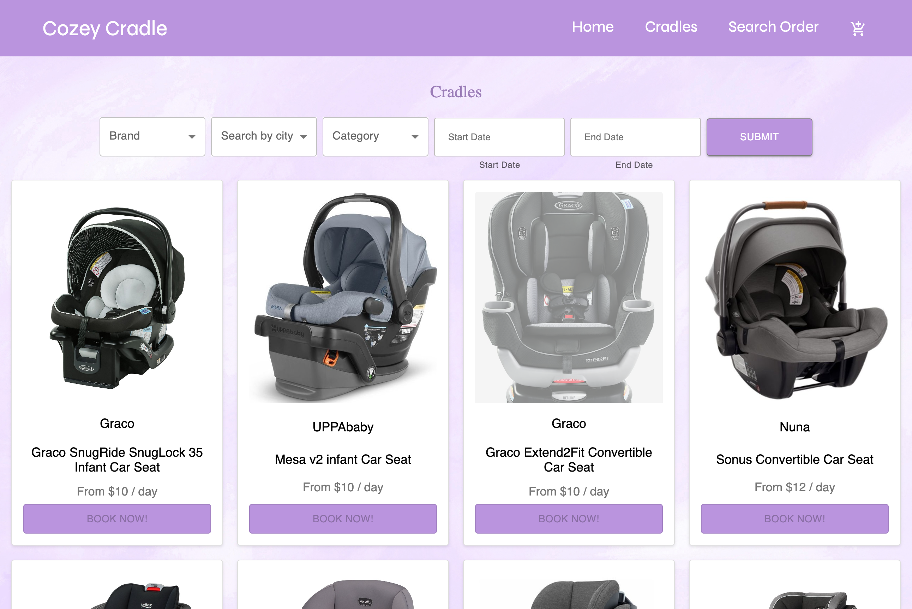
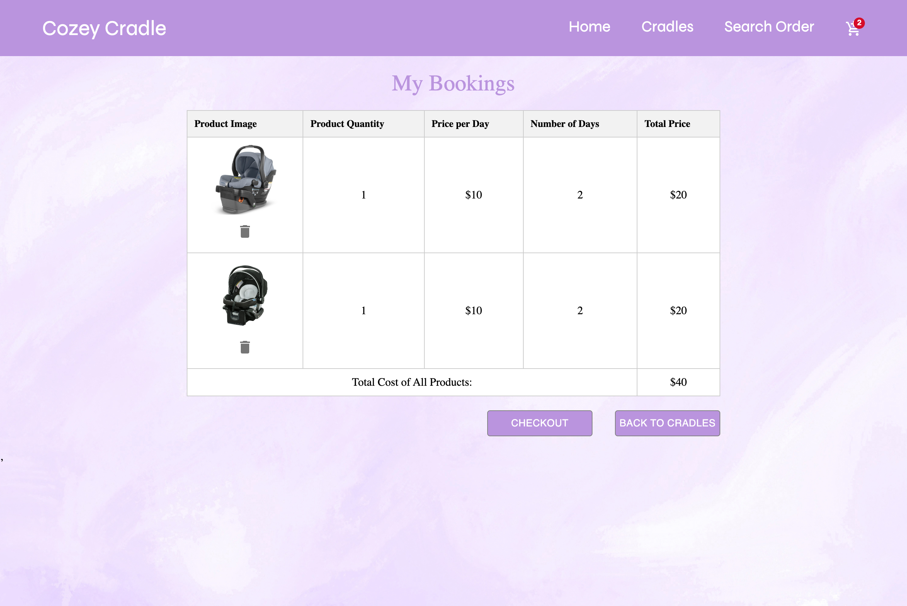
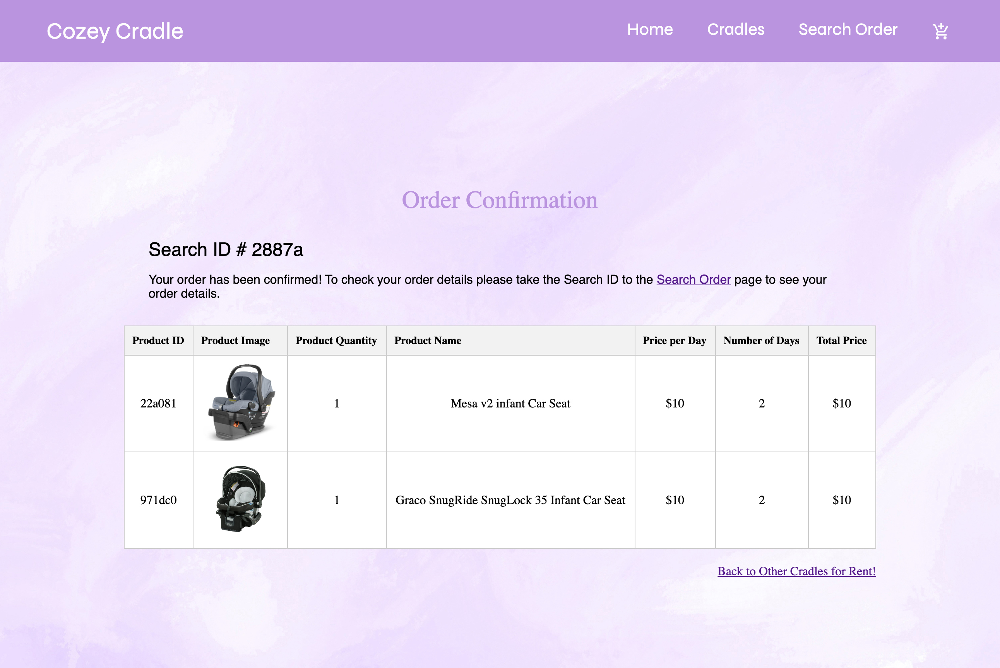

# [Cozey Cradle](https://balmy-afternoon-production.up.railway.app/) - Click to view project

Cozy Cradle is a baby car seat rental service that allows users to rent car seats for their infants. This web application is built using the MERN stack (MongoDB, Express, React, Node.js). Users can browse and filter through a variety of car seats, select the desired rental date and city, add items to the cart, and complete the checkout process using Stripe for payment. Each order is assigned a unique 5-digit confirmation code for easy reference.

## Features

- Browse and filter the inventory of car seats
- Select the desired rental date
- View detailed information about each product
- Add items to the cart
- Checkout using Stripe for secure payment processing
- Receive a 5-digit confirmation code upon successful checkout
- Search for an order using the confirmation code

## Technologies Used

- MERN stack (MongoDB, Express, React, Node.js)
- Stripe
- Material-UI (MUI v5)
- React-Toastify
- DotEnv
- Moment
- Serve

## Screenshots

_Home page screenshot._

_Car seats page screenshot._

_Order page screenshot._

_Confirmation page screenshot._

## Created by:

- [GitHub - Mfried95](https://github.com/Mfried95)
- [GitHub - rida-batool](https://github.com/rida-batool)
- [GitHub - yusufurur](https://github.com/yusufurur)

## Installation

Follow these steps to get the project up and running:

git clone git@github.com:Mfried95/cozey-cradle.git

- npm install
- cd backend and npm start
- cd frontend and npm run dev
